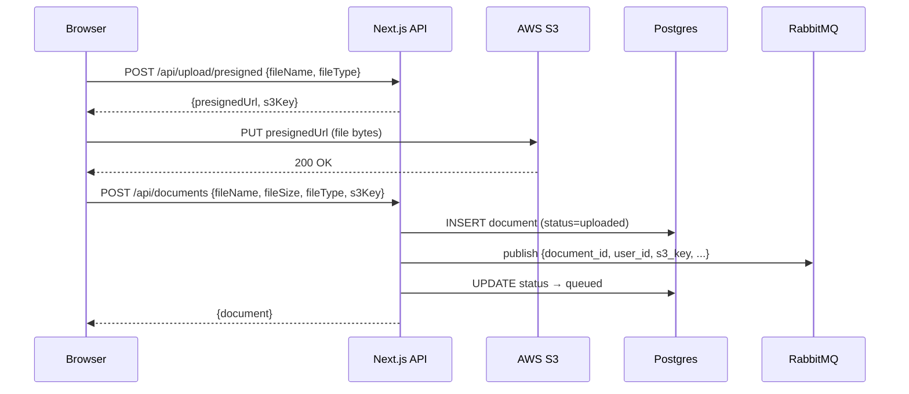

# Walkthrough: Dashboard & Upload Pipeline

## What was built

The full **Browser → S3 → Postgres → RabbitMQ** upload pipeline, along with a functional dashboard UI that replaces the previous hardcoded placeholder.

---

## Files Changed

### Infrastructure
| File | Change | Purpose |
|------|--------|---------|
| [docker-compose.yml](file:///c:/Users/ROG%20Zephyrus/dev/AskPDF/docker-compose.yml) | Modified | Added `rabbitmq` service (with management UI on port 15672) |
| [.env](file:///c:/Users/ROG%20Zephyrus/dev/AskPDF/.env) | Modified | Added `RABBITMQ_URL` |
| [next.config.ts](file:///c:/Users/ROG%20Zephyrus/dev/AskPDF/app/web/next.config.ts) | Modified | Added `serverExternalPackages: ["amqplib"]` |

---

### Backend Utilities (New)
| File | Purpose |
|------|---------|
| [s3.ts](file:///c:/Users/ROG%20Zephyrus/dev/AskPDF/app/web/lib/s3.ts) | Shared AWS S3 client |
| [rabbitmq.ts](file:///c:/Users/ROG%20Zephyrus/dev/AskPDF/app/web/lib/rabbitmq.ts) | RabbitMQ connection, channel, and `publishDocumentJob()` helper |

---

### API Routes
| File | Change | Purpose |
|------|--------|---------|
| [presigned/route.ts](file:///c:/Users/ROG%20Zephyrus/dev/AskPDF/app/web/app/api/upload/presigned/route.ts) | **New** | `POST` — auth-guarded, returns S3 presigned URL + s3Key |
| [documents/route.ts](file:///c:/Users/ROG%20Zephyrus/dev/AskPDF/app/web/app/api/documents/route.ts) | Modified | Added `GET` handler to list user's docs; existing `POST` creates doc → publishes to RabbitMQ → updates status to `queued` |

---

### Frontend Components (New)
| File | Purpose |
|------|---------|
| [UploadZone.tsx](file:///c:/Users/ROG%20Zephyrus/dev/AskPDF/app/web/components/UploadZone.tsx) | Drag-and-drop upload with real progress (XHR → S3), status transitions, error/retry states |
| [DocumentList.tsx](file:///c:/Users/ROG%20Zephyrus/dev/AskPDF/app/web/components/DocumentList.tsx) | Fetches real documents from API, shows status badges, loading skeletons, empty state |
| [DashboardContent.tsx](file:///c:/Users/ROG%20Zephyrus/dev/AskPDF/app/web/components/DashboardContent.tsx) | Client wrapper tying upload + list together with shared `refreshKey` |

### Frontend Pages (Modified)
| File | Change |
|------|--------|
| [dashboard/page.tsx](file:///c:/Users/ROG%20Zephyrus/dev/AskPDF/app/web/app/dashboard/page.tsx) | Replaced hardcoded placeholder with `<DashboardContent />` |

---

## Upload Flow (end-to-end)



---

## How to Test

1. **Start RabbitMQ**:
   ```bash
   docker compose up -d rabbitmq
   ```
2. **Start the dev server** (already running):
   ```bash
   npm run dev
   ```
3. **Navigate** to `/dashboard` while signed in
4. **Upload a PDF** via drag-and-drop or click
5. **Verify**:
   - S3: File should appear at `s3://askpdf-document-upload/{clerkId}/{uuid}.pdf`
   - Postgres: `SELECT * FROM documents;` should show a row with status `queued`
   - RabbitMQ: Visit `http://localhost:15672` (guest/guest) → Queues → `document_processing` should have 1 message

> [!IMPORTANT]
> The RabbitMQ container must be running for the `POST /api/documents` route to succeed. If it's not running, the upload to S3 will succeed but the document registration will fail with a 500 error.
